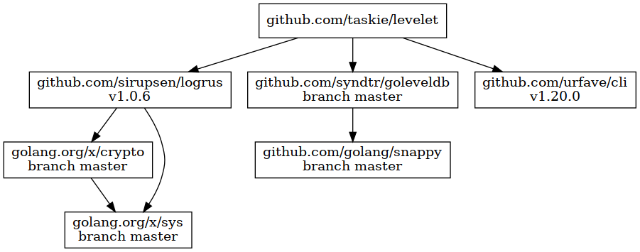

# levelet

too simple LevelDB manipulator

## install

```sh
go get github.com/taskie/levelet/cmd/levelet
```

## usage

### get

Use get (g) subcommand.

```sh
levelet -f foo.ldb g key
# or use environment variable
env LEVELET_DB_PATH=foo.ldb levelet g key
```

### put

Use put (p) subcommand.

```sh
echo value | levelet -f foo.ldb p key
```

### delete

Use delete (d) subcommand.

```sh
levelet -f foo.ldb d key
```

### list

Use list (l) subcommand.

```sh
levelet -f foo.ldb l
# or specify prefix of keys
levelet -f foo.ldb l k
```

## dependency



## license

Apache License 2.0
